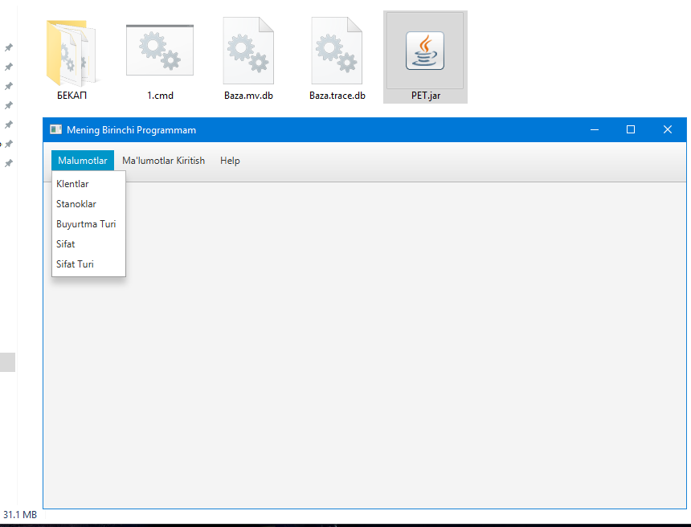
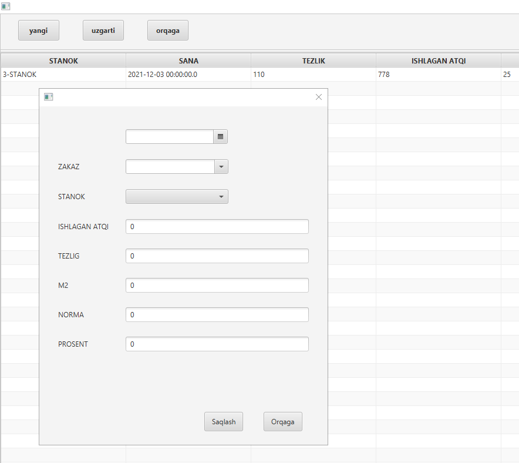
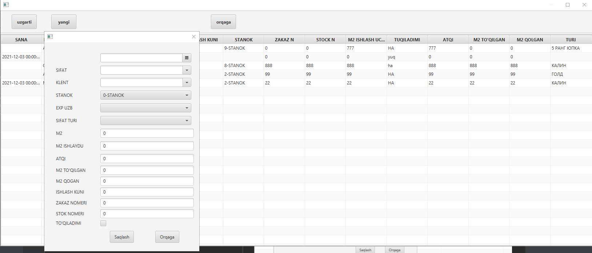

# JavaFx_Hibernate_SQLDB
Hi..!

This is my first pet project created after the JAVARUSH online course

Project is ready for compiling and use as executable .JAR

Now App uses H2 database file from root folder where executed, App can work with PostgresSQL,MSSQL;

On project i use external libs:

Hibernate:

Lombok:

javafx-maven-plugin: for executable .JAR

maven-shade-plugin:  for packing externals libs into .JAR and excluding META-INF files from signatured libs.

